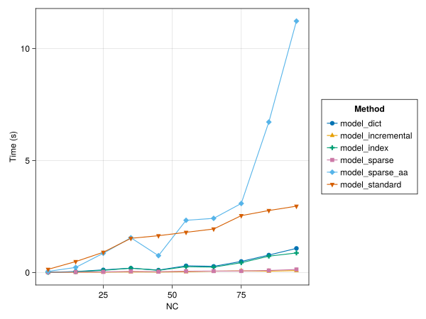

# SparseVariables.jl

[](https://github.com/hellemo/SparseVariables.jl/actions?query=workflow%3ACI)
[](https://codecov.io/gh/hellemo/SparseVariables.jl)

This package contains routines for improved performance and easier handling of sparse data 
and sparse arrays of optimizaton variables in JuMP. 

Watch the JuliaCon/JuMP-dev 2022 lightning talk and check out the [notebook with examples and bencmarks]("docs/notebook_juliacon2022.jl"): 

[](https://youtu.be/YuDvfZo9W5A)

2022-09: Updated benchmarks of time spent on model construction with different number of variables (see [benchmark notebook for details](benchmark/benchmark.jl)) with additional types `IndexedVarArray` (model_indexed) and `SparseAxisArray` (model_sparse_aa) on current julia master:



Benchmarks with time spent on model construction with different level of sparsity:


## Usage

```julia
using JuMP
using SparseVariables

const SV = SparseVariables

m = Model()

cars = ["ford", "bmw", "opel"]
year = [2000, 2001, 2002, 2003]

car_cost = SparseArray(Dict(
    ("ford", 2000) => 100,
    ("ford", 2001) => 150,
    ("bmw", 2001) => 200,
    ("bmw", 2002) => 300
    ))

# Variable defined for a given set of tuples
@sparsevariable(m, y[car, year] for (car,year) in keys(car_cost))

# Empty variable with 2 indices
@sparsevariable(m, z[car, year])

# Dynamic creation of variables
for c in ["opel", "tesla", "nikola"]
    insertvar!(z, c, 2002)
end

# Inefficient iteration, but 0 contribution for non-existing variables
@constraint(m, sum(y[c,i] + z[c,i] for c in cars, i in year) <= 300)

# Slicing over selected indices
@constraint(m, sum(y[:, 2000]) <= 300)

# Efficient filtering using select syntax
for i in year
    @constraint(m, sum(car_cost[c,i] * y[c,i] for (c,i) in SV.select(y, :, i)) <= 300)
end

# Filter using functions on indices
@constraint(m, sum(z[endswith("a"), iseven]) >= 1)
```

## IndexedVarArray

Use IndexedVarArrays to check for valid indices and to warn against duplicate 
indices, as well as improved performance:

```julia
    w = IndexedVarArray(m, "w", (car=cars, year=year))
    m[:w] = w

    for c in cars, y in year
        insertvar!(w, c, y)
    end
```


## Solution information

SparseVariables.jl provides `SolutionTable` that supports the [Tables.jl](https://github.com/JuliaData/Tables.jl) interface, allowing 
easy output of solution values to e.g. a `DataFrame` or a csv-file
```julia
using CSV
using DataFrames
using HiGHS

# Solve m
set_optimizer(m, HiGHS.Optimizer)
optimize!(m)

# Fetch solution
tab = table(y)

# Save to CSV
CSV.write("result.csv", tab)

# Convert to DataFrame
df_y = dataframe(y)
df_z = DataFrame(table(z))
```
The Tables interface is also implemented for `DenseAxisArray`, allowing the functionality to be used also for normal
dense JuMP-variables. Since the container does not provide index names, these have to be given as explicit arguments:


```julia
# Add dense variable u
@variable(m, u[cars, year])

for c in cars, y in year
    @constraint(m, u[c, y] <= 1)
end

# Solve
set_optimizer(m, HiGHS.Optimizer)
optimize!(m)

# Read solution values for u
tab = table(u, :u, :car, :year)
df = DataFrame(tab)
```

Note that output to a DataFrame through the `dataframe` function is only possible if `DataFrames` is loaded
before `SparseVariables`.