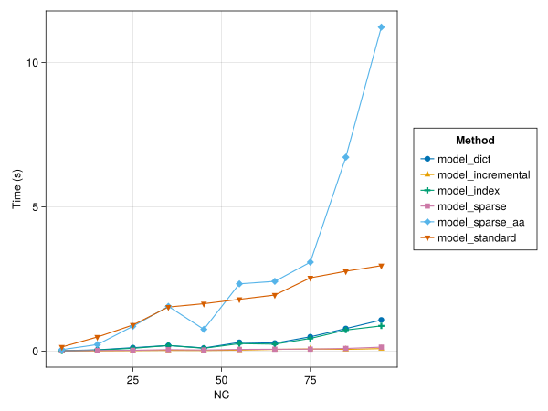
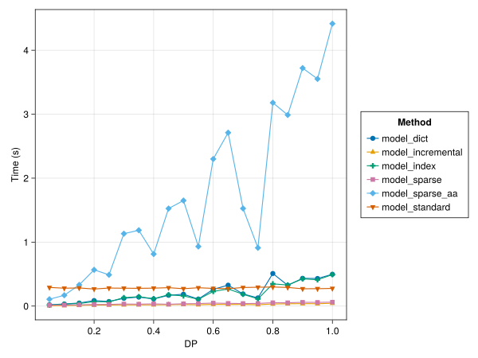

# SparseVariables

Add container type(s) for improved performance and easier handling of sparse data 
and sparse arrays of optimizaton variables in [JuMP](https://jump.dev/JuMP.jl/stable/). 

Watch the JuliaCon/JuMP-dev 2022 lightning talk and check out the [notebook with examples and benchmarks](https://github.com/sintefore/SparseVariables.jl/blob/main/%22docs/notebook_juliacon2022.jl): 

Some motivational benchmark demonstrate that `SparseVariables` (`model_sparse`) can give similar performance to manually constructing efficent indices (`model_incremental`), but with a much simpler and and more modeller-friendly syntax, while outperforming alternative implementations:

Time spent on model construction can vary a lot depending on the level of sparsity (here constructed by varying sparsity level through parameter `DP`):

